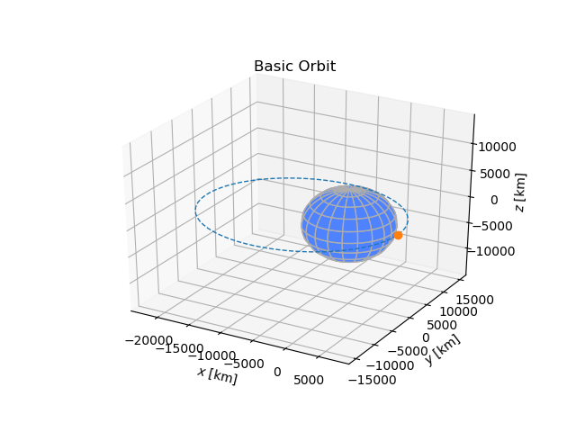
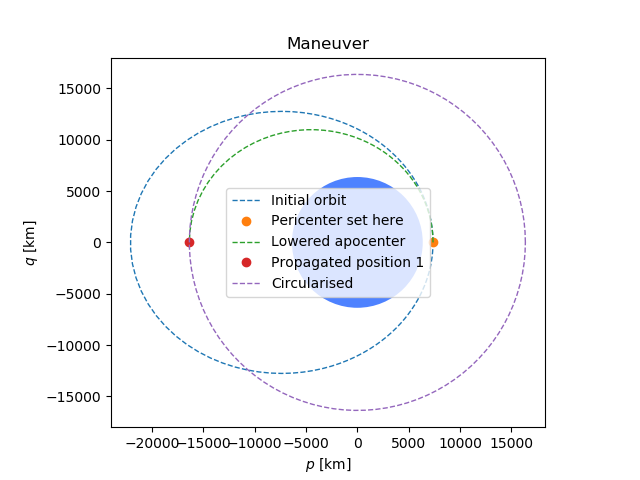
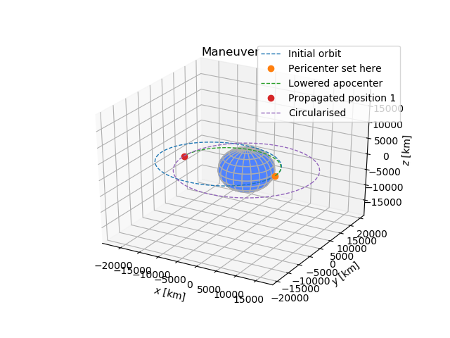

#Scope
The purpose of this document is to outline the basic pricipals of orbital dynamics, and demonstrate how different code libraries can be used to achieve graphic modeling and scientific computing.

##Outline of Orbital Dynamics

```{python}
a #Semimajor Axis
e #Eccentricity 


```


#Code

###Python Code
The main code library used in this work is [OrbitalPy](http://pythonhosted.org/OrbitalPy/).  
The basic code utilises the keplerian elements of orbital mechanics as *KeplerianElements*.  
As part of the computation we also invoke the Numpy, Matplot and ScipPy libraries.

```{python, engine.path="/Users/Mark/anaconda3/python", results = 'hold'}
from numpy import radians
from scipy.constants import kilo
import matplotlib.pyplot as plt
from orbital import earth, KeplerianElements,plot3d
# Define the orbital parameters
orbit1 = KeplerianElements.with_altitude(1000*kilo,body=earth, e=0.5)

# Plots in 3d the orbital parameters, including the defined maneuver.
plot3d(orbit1,title='Basic Orbit',)
plt.savefig('orbit_one.png')


```



In this example, the orbital eccentricity is set to *e=0.5* showing that the orbit is eliptical.  


```{python}
from numpy import radians
from scipy.constants import kilo
import matplotlib.pyplot as plt
from orbital import earth, KeplerianElements, plot, earth_sidereal_day, Maneuver,plot3d
# Define the orbital parameters
orbit3 = KeplerianElements.with_altitude(1000*kilo,body=earth, e=0.5)
# Define the maneuver type, and parameters
man7 = Maneuver.hohmann_transfer_to_altitude(10000*kilo)
# Plots in 3d the orbital parameters, including the defined maneuver.
my_orbit = plot3d(orbit3,title='Maneuver',maneuver=man7)
plot(orbit3, title='Maneuver',maneuver=man7)
plt.savefig('orbit_two_2d.png')
plot3d(orbit3, title='Maneuver',maneuver=man7)
plt.savefig('orbit_two_3d.png')
```




###R Code
Similar results to the python code can be achieved using R

```{r}
#Initialize
a <- 1                  # semi-major axis
e <- 1/sqrt(2)          # eccentricity
b <- a * sqrt(1 - e^2)  # semi-minor axis
c <- e * a              # distance from the center to a focus

# Distance from a focus to the center.
x.c <- -c
y.c <- 0
z.c <- 0

# Generate a numerical sequence
u <- seq(-pi,pi, length.out=80)

# Generate x and y values.
x <- a * cos(u) - e
y <- a * sqrt(1-e^2) * sin(u)
z <- rep(0, times=80)

c.x <- a * cos(u) - c
c.y <- a * sin(u)         # Generate points for an outer circle.
c.z <- rep(0, times=80)

# Plot x & y with a line.
plot(x,y,type="l", ylim=c(-a*sin(pi/2), a*sin(pi/2)),asp=1)
points(c.x,c.y,type="l", col="green")
```
```{r}
# Pitch ~ inclination, tilt about the y axis.
x.inc <- rep(0, times=80)
y.inc <- rep(0, times=80)
z.inc <- rep(0, times=80)

for (i in 1:80) {
 point <- rotate3d(c(x[i],y[i],z[i]),pi/5,0,1,0)
 x.inc[i] <- point[1]
 y.inc[i] <- point[2]
 z.inc[i] <- point[3]
}
# Transform the focus for the central body.
center <- rotate3d(c(x.c,y.c,z.c),pi/5,0,1,0)

# Yaw ~ longitude of the ascending node (omega),
# so rotate around the z axis.
x.om <- rep(0, times=80)
y.om <- rep(0, times=80)
z.om <- rep(0, times=80)

for (i in 1:80) {
 point <- rotate3d(c(x.inc[i],y.inc[i],z.inc[i]),pi/4,0,0,1)
 x.om[i] <- point[1]
 y.om[i] <- point[2]
 z.om[i] <- point[3]
}
# Transform the focus for the central body.
center <- rotate3d(c(center[1],center[2],center[3]),pi/4,0,0,1)

# Roll ~ Right ascension of the ascending node (RAAN),
# so rotate around the x axis.
x.raan <- rep(0, times=80)
y.raan <- rep(0, times=80)
z.raan <- rep(0, times=80)

for (i in 1:80) {
 point <- rotate3d(c(x.om[i],y.om[i],z.om[i]),pi/4,1,0,0)
 x.raan [i] <- point[1]
 y.raan [i] <- point[2]
 z.raan [i] <- point[3]
}
# Transform the focus for the central body.
center <- rotate3d(c(center[1],center[2],center[3]),pi/4,1,0,0)
```

```{r}
# Plot the transformed elliptical orbit.
par3d(zoom=0.8, windowRect = c(200, 5, 800, 400))
mfrow3d(nr = 1, nc = 3, sharedMouse = TRUE) 

plot3d(x=x.inc,y=y.inc,z=z.inc, type="l", col="red")
next3d()
plot3d(x=x.om,y=y.om,z=z.om, type="l", col="blue")
next3d()
plot3d(x=x.raan ,y=y.raan ,z=z.raan, type="l", col="green")
rglwidget()

```

#The Actual Flight
###Orbital Parameters

**Regime** = *Low Earth Orbit*  
**Perigee** = *149km*  
**Apogee** = *248km*  
**Inclination** = *32.5 degrees*  
**Period** = *88.47 Minutes*  